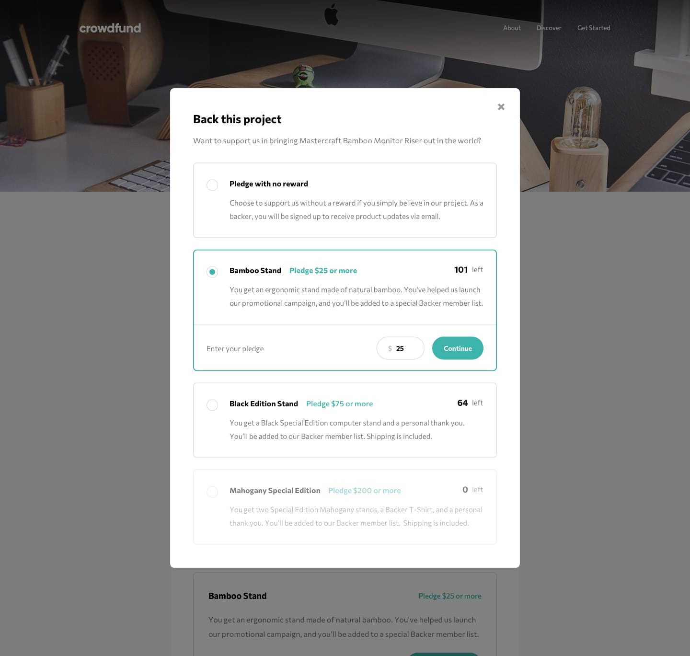
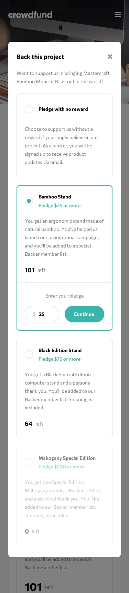

# Frontend Mentor - Crowdfunding product page

## Welcome! 👋

Frontend Mentor's Crowdfunding product page challenge,

- rebuilt this challenge with react and tryin along with both typescript and zustand.

- states are check if it exist on local storage if not it will fetch on [JSONBIN](https://jsonbin.io/) API and then save it again in the local storage.

- every data state change along with being bookmarked are saved and sync for changes with local storage. 

## Design

Mobile | Desktop
--- | ---
 | 

Default | Selected | Completed
--- | --- | ---
 |  | 

Default | Selected | Completed
--- | --- | ---
 |  | 

Default | Bookmarked | Default-Modal | Selected | Completed
--- | --- | --- | --- | ---
 |  |  |  | 

****

## Links

-   ### Live Site URL : [here](https://crowdfunding-product-page-react-omega.vercel.app/)
-   ### Frontend Mentor(FEM) Solution URL : [here]()

****

## Built with
-   ### React
-   ### Tailwindcss
-   ### Typescript
-   ### Vite
-   ### Zustand
-   ### Mobile-first workflow
-   ### JSONBIN for [API](https://jsonbin.io/)
****

